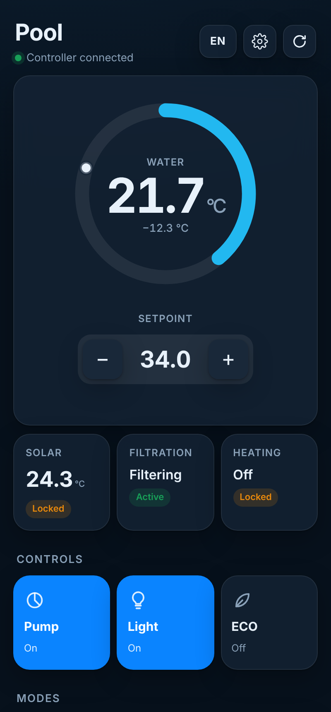
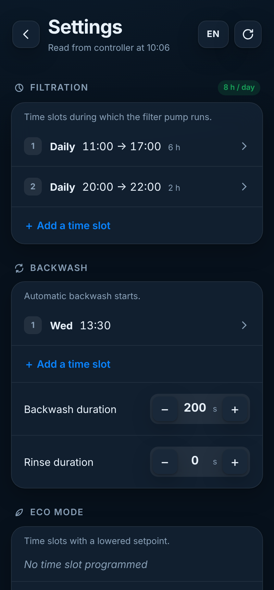
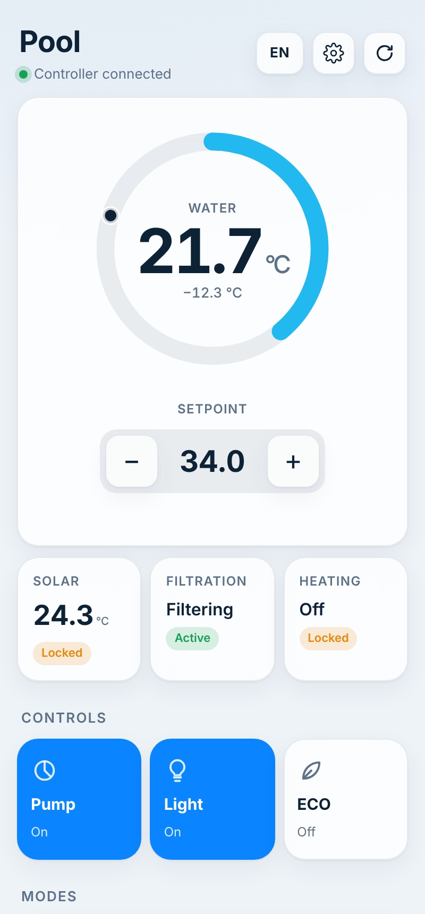

# OSF PoolControl UI

**A modern web interface and Home Assistant bridge for OSF PoolControl .NET pool controllers.**

> ⚠️ **Unofficial project.** Not affiliated with, endorsed by or supported by OSF.
> It talks to the controller through its built-in web server, exactly like the original web pages do.
> You use it at your own risk — it switches pumps, heating and backwash valves.

<p align="center">
  
  
  
</p>

## Features

- **Live dashboard** — water and solar temperature, setpoint, filtration and heating status, pushed to the browser every 10 s
- **Controls** — setpoint (±0.5 °C), manual filter pump, pool light (AUX), ECO mode, heater/solar/AUX modes, backwash (press & hold)
- **Timers & advanced settings** — filtration, backwash, ECO and light time slots (add / edit / delete), daily filtration total, overlap warning, backwash & rinse durations, ECO reduction, AUX time limit
- **Smart light** — the AUX output is usually interlocked with the filter pump; turning the light on starts the pump first
- **Home Assistant** — MQTT discovery (sensors, switches, number, button) for dashboards and automations, e.g. filtering on solar surplus
- **Installable app (PWA)**, light & dark mode, **English / Français / Deutsch**

## Compatibility

| Controller | Firmware | Status |
|---|---|---|
| PoolControl-40.NET (PC-40.net) | 2.6 | ✅ tested |
| Other OSF `.NET` controllers (PC-50, EUROMATIK.net…) | — | ❓ probably similar, [help us test](.github/ISSUE_TEMPLATE/new_model.md) |

The controller must be reachable on your local network, with its **user PIN** (4 digits) to send commands.

## Installation

### Option A — Home Assistant add-on (Home Assistant OS / Supervised)

[](https://my.home-assistant.io/redirect/supervisor_add_addon_repository/?repository_url=https%3A%2F%2Fgithub.com%2FGoldenBlack4%2Fosf-poolcontrol-ui)

1. *Settings → Add-ons → Add-on store → ⋮ → Repositories* → add `https://github.com/GoldenBlack4/osf-poolcontrol-ui`
2. Install **OSF PoolControl UI**, set the **controller address** and **PIN**, start it.
3. Open **Pool** in the sidebar. If the Mosquitto add-on is installed, the **Pool** device appears automatically.

### Option B — Docker (any Linux server, NAS, Raspberry Pi, HA Container…)

```bash
mkdir osf-poolcontrol && cd osf-poolcontrol
curl -O https://raw.githubusercontent.com/GoldenBlack4/osf-poolcontrol-ui/main/docker-compose.yml
curl -o .env https://raw.githubusercontent.com/GoldenBlack4/osf-poolcontrol-ui/main/app/.env.example
nano .env            # set OSF_HOST, OSF_PIN (and MQTT_* for Home Assistant)
docker compose up -d
```

Open `http://<server>:8090`. On a phone: browser menu → *Add to Home screen*.

### Configuration (environment variables)

| Variable | Default | Description |
|---|---|---|
| `OSF_HOST` | — | Controller address, e.g. `http://192.168.1.50` (**required**) |
| `OSF_PIN` | — | User PIN, needed for any command |
| `POLL_MS` | `10000` | Polling interval (ms) |
| `APP_PASSWORD` | — | Basic-auth password for the UI (user `pool`) |
| `MQTT_URL` | — | e.g. `mqtt://192.168.1.10:1883` — enables the MQTT bridge |
| `MQTT_USER` / `MQTT_PASS` | — | Broker credentials |
| `MQTT_PREFIX` | `poolcontrol` | Topic prefix |
| `MQTT_DEVICE_NAME` | `Pool` | Device name in Home Assistant |
| `MQTT_OBJECT_PREFIX` | `pool` | Entity ID prefix (`sensor.pool_water_temp`…) |
| `AUX_STARTS_PUMP` | `true` | Light ON via MQTT starts the pump first |

## Home Assistant entities

| Entity | Type |
|---|---|
| Water temperature, Solar temperature | `sensor` (°C) |
| Filtration, Heating, Heater mode, Solar mode | `sensor` |
| Controller online | `binary_sensor` |
| Water setpoint | `number` |
| Manual pump, Pool light, ECO mode | `switch` |
| Backwash | `button` |

<details>
<summary>Example: filter on solar surplus (evcc)</summary>

```yaml
alias: Pool – filter on PV surplus
triggers:
  - trigger: numeric_state
    entity_id: sensor.evcc_grid_power   # negative = export
    below: -1500
    for: "00:10:00"
    id: surplus
  - trigger: numeric_state
    entity_id: sensor.evcc_grid_power
    above: 200
    for: "00:10:00"
    id: done
actions:
  - choose:
      - conditions: [{ condition: trigger, id: surplus }]
        sequence: [{ action: switch.turn_on, target: { entity_id: switch.pool_pump } }]
      - conditions: [{ condition: trigger, id: done }]
        sequence: [{ action: switch.turn_off, target: { entity_id: switch.pool_pump } }]
```
</details>

## Security

- **Never expose the app directly to the Internet.** Use a VPN (WireGuard, Tailscale) or a reverse proxy with authentication.
- Set `APP_PASSWORD` if other people use your network.
- The PIN stays on the server; it is never sent to the browser.

## How it works

The controller's web pages use a small JSON file (`/index.jsn`) and GET requests like `/modify?0110=28.0`.
The app reads these pages, queues requests one by one (the controller only handles one connection at a time)
and exposes a clean API, a PWA and MQTT. See **[docs/PROTOCOL.md](docs/PROTOCOL.md)**.

```
Browser / phone ──► app (Node.js) ──► PoolControl .NET
Home Assistant ◄─MQTT─┘
```

## Development

```bash
cd app
npm install
npm run mock &      # fake controller on :8099 (built from real firmware responses)
npm run dev         # app on :8080 against the mock
npm test            # end-to-end smoke test
```

Contributions welcome — see [CONTRIBUTING.md](CONTRIBUTING.md). Version française : [docs/README.fr.md](docs/README.fr.md).

## License

[MIT](LICENSE). "OSF" and "PoolControl" are trademarks of their respective owner, used here only to describe compatibility.
